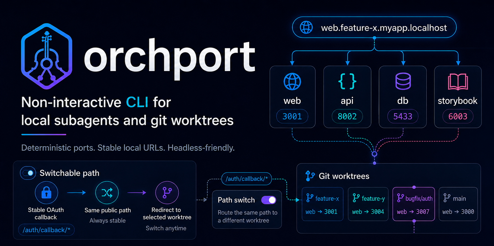

<div align="center">

# 🎻 Orchport 🔌

  

ローカルのサブエージェントや git worktree 向けの非対話型 CLI です。複数の dev サーバーのポート衝突を避け、`web.<worktree>.myapp.localhost` のようなホスト規則で URL を組み立て、結果を `ORCHPORT_*` として子プロセスへ渡します。

</div>

## なぜ orchport か

> [!NOTE]
> [Vercel Labs / portless](https://github.com/vercel-labs/portless) のように、ローカル用の名前付き URL やプロキシを TTY 前提で起動するツールは、ヘッドレスなエージェントやワンショット実行では扱いづらいことがあります（例: [非対話環境でのプロンプト](https://github.com/vercel-labs/portless/issues/224)）。
>
> orchport はプロンプトを出さず、`orchport run -- cmd` で決定的に終わることを前提にしています。

## インストール

npm:

```bash
npm install -g orchport
```

プロジェクトごとに固定する場合:

```bash
npm install -D orchport
```

Nix flakes:

```bash
nix profile install github:ReoHakase/orchport
```

リリース tarball を直接使う場合は、GitHub Releases の `orchport-vX.Y.Z-<target>.tar.gz` と `SHA256SUMS` を確認してください。npm / nix は同じ single-binary release artifact を使います。

## 主なコマンド

| コマンド          | 役割                                                                                                                                                                                                 |
| ----------------- | ---------------------------------------------------------------------------------------------------------------------------------------------------------------------------------------------------- |
| `orchport run`    | 設定を読み、ポートと URL を解決。`local-proxy` ならリバースプロキシを立ててから子コマンドを実行。`orchport run web -- cmd` のように先頭に **プロキシ名** を置くと、そのプロキシの `env` だけをマージ |
| `orchport env`    | 解決結果のみ表示（TTY ではプロキシ別テーブル、JSON / plain / shell 向けなど）                                                                                                                        |
| `orchport list`   | 記録された run の一覧                                                                                                                                                                                |
| `orchport kill`   | 記録に基づきプロセスへシグナル                                                                                                                                                                       |
| `orchport doctor` | 状態ディレクトリの作成・読み書き試行と設定読み込みの簡易チェック                                                                                                                                     |
| `orchport init`   | 設定ファイルの雛形生成                                                                                                                                                                               |
| `orchport switch` | `switchables` パスの向き先 worktree を更新（後述）                                                                                                                                                   |

パススイッチ: OAuth コールバックなど、ホストは共通のまま特定パスだけ別 worktree のバックエンドへ振り分けられます。

## 状態ディレクトリとエージェントのサンドボックス

run の記録やパススイッチの所有者など、共有状態は **`$XDG_STATE_HOME/orchport`** に保存します。`XDG_STATE_HOME` が未設定のときは XDG の既定どおり **`~/.local/state/orchport`** です。テストや特殊環境では **`ORCHPORT_STATE_DIR`** で上書きできます。解決されたパスと、状態ディレクトリへの **読み取り・書き込みが成功したこと** は **`orchport doctor`** の一行出力で確認できます。

Cursor・Codex・Claude Code などのサンドボックスはワークスペース外への書き込みを許可していないことが多いので、orchport の状態ディレクトリへの読み書きが必要なときは、次のように **絶対パス**（例: macOS では `/Users/you/.local/state/orchport`）を追加してください。細部は各製品の最新ドキュメントを参照してください。

| 環境            | 設定の置き場                                                                                                                           | 内容                                                                                                                                                                                                                                  |
| --------------- | -------------------------------------------------------------------------------------------------------------------------------------- | ------------------------------------------------------------------------------------------------------------------------------------------------------------------------------------------------------------------------------------- |
| **Cursor**      | [`sandbox.json`](https://cursor.com/docs/reference/sandbox)（`~/.cursor/sandbox.json` またはリポジトリの `.cursor/sandbox.json`）      | `type` が `workspace_readwrite` のとき、**`additionalReadwritePaths`** に状態ディレクトリの絶対パスを追加する（ユーザー設定とリポジトリ設定はマージされる）。                                                                         |
| **Codex**       | [`~/.codex/config.toml`](https://developers.openai.com/codex/config-reference)（信頼済みプロジェクトなら `.codex/config.toml`）        | `sandbox_mode = "workspace-write"` とし、**`sandbox_workspace_write.writable_roots`** に同じ絶対パスを追加する。CLI では **`--add-dir`** で追加できる場合がある。                                                                     |
| **Claude Code** | [`settings.json`](https://code.claude.com/docs/en/configuration)（`~/.claude/settings.json` やプロジェクトの `.claude/settings.json`） | **`sandbox.filesystem.allowWrite`** に絶対パスを追加する（配列はスコープ間でマージされる）。組み込みファイルツールでそのパスを扱う場合は **`additionalDirectories`** も必要になることがある（状態はワークスペース外に置かれるため）。 |

## 使い方（概要）

```bash
orchport doctor
orchport env --json
orchport run -- turbo dev
```

`run` で子に渡る例: `ORCHPORT_WEB_PORT` などプロキシ単位の変数、`ORCHPORT_SLD` / `ORCHPORT_TLD` / `ORCHPORT_WORKTREE` など。

設定ファイルはカレントから親へ向かって探索します。例: `orchport.config.ts`, `orchport.yaml`, `orchport.json`。

### グローバルオプション（サブコマンドより前）

| オプション          | 意味                                                                                     |
| ------------------- | ---------------------------------------------------------------------------------------- |
| `--config <path>`   | 設定ファイルを明示                                                                       |
| `--sld <name>`      | ホスト名のラベル（例: `*.myapp.localhost` の `myapp`）を上書き                           |
| `--tld <suffix>`    | 公開サフィックスを上書き。`localhost` や `.test` など。先頭の `.` は有無どちらでも正規化 |
| `--worktree <name>` | worktree 名を上書き                                                                      |
| `--version`         | バージョンを表示                                                                         |
| `--verbose`, `-v`   | `orchport.*` ロガーを trace まで出す                                                     |
| `--quiet`, `-q`     | warning / error のみに抑える                                                             |
| `--no-color`        | ANSI 色を無効化                                                                          |
| `--force-switch`    | `orchport run` のみ。パススイッチのスロットが他 worktree のものでも奪って続行            |
| `--json`            | 致命的エラーを stderr に JSON で出す                                                     |

> [!TIP]
> 子コマンドが `-` で始まる引数を取る場合は `orchport run -- cmd ...` のように `--` で区切ってください。

## ポート選択アルゴリズム

| 項目                     | 内容                                                                                                                                                                                               |
| ------------------------ | -------------------------------------------------------------------------------------------------------------------------------------------------------------------------------------------------- |
| レンジの元               | エントリの `range` が `"auto"`（省略含む）→ ルートの `portRange`。ルート省略時は `[43100, 43999]`                                                                                                  |
| 明示レンジ               | `[min, max]` はその閉区間のみ。`min === max` は固定ポートとして扱う                                                                                                                                |
| 戦略 `strategy`          | `smaller`: min から昇順 / `larger`: max から降順 / `deterministic`（既定）: `hashStable(sld + "\0" + worktree + "\0" + entryName)` で開始位置を決め、レンジ内を一周する順で試す（FNV-1a 風 32bit） |
| 空き判定                 | 決めた順で、同一解決内ですでに使ったポートを除き、`127.0.0.1` で短時間 TCP リッスンできる最初の番号                                                                                                |
| 固定ポートが埋まっている | `strict: true` → エラー。`strict: false`（既定）→ 警告のうえグローバル `portRange` へフォールバック                                                                                                |
| 区間内に空きなし         | 同上。`strict: false` ならグローバル `portRange` へ、`true` ならエラー                                                                                                                             |

## パススイッチ（`switchables`）

> [!IMPORTANT]
> [Better Auth](https://www.better-auth.com/) などで OAuth コールバックを扱う場合、リダイレクト先 URL はアプリ側で 1 本に決める必要があります。一方で Google や GitHub などの OAuth プロバイダーは、開発用クライアントに **登録できるコールバック URL が 1 つ** に限られることが多く、worktree ごとに別ホスト・別 URL を登録し直すのは現実的ではありません。
>
> そのため「公開 URL とコールバックパスは常に同じにしつつ、プロキシだけ別 worktree の API に切り替える」パススイッチが必要になります。

`local-proxy` でプロキシを立てているとき、プロキシに **`switchables`**（文字列の配列）を付けると、マッチしたパスだけ別 worktree の同じプロキシ名の dev サーバーへ転送できます。

| トピック                 | 説明                                                                                                                                                                      |
| ------------------------ | ------------------------------------------------------------------------------------------------------------------------------------------------------------------------- |
| パターン                 | 完全一致 `/path` または末尾 `/prefix/*` のみ。`**` や途中の `*` は不可                                                                                                    |
| 状態                     | `ORCHPORT_STATE_DIR` または XDG 下の `switches.json` にスロット所有者を記録                                                                                               |
| `orchport run`           | `switchables` があると現在の worktree がスロットを claim。他が持っていればエラー。`--force-switch` で上書き                                                               |
| `orchport switch <slug>` | 設定内の全 `switchables` スロットの向き先を指定 worktree に更新。プロキシ再起動は不要。ポートはその worktree＋プロキシ名の最新 run 状態から。無ければ該当リクエストは 502 |
| 振る舞い                 | 通常は Host でバックエンドを決め、パスが `switchables` のいずれかに一致すると別ポートへ上書き転送                                                                         |

## 設定ファイル（ルート）

| キー        | 型のイメージ                  | 既定・補足                                                                                              |
| ----------- | ----------------------------- | ------------------------------------------------------------------------------------------------------- |
| `sld`       | 文字列                        | 省略時: git トップのディレクトリ名 → なければカレント名からスラッグ。ホスト `*.<sld><tld>`              |
| `tld`       | 文字列                        | 省略時: `.localhost`。読み込み時に先頭 `.` を正規化                                                     |
| `worktree`  | 文字列                        | 省略時: git から検出                                                                                    |
| `mode`      | `local-port` \| `local-proxy` | 既定: `local-port`。`local-proxy` で内蔵リバプロとプロキシ経由 URL                                      |
| `portRange` | `[number, number]`            | 既定: `[43100, 43999]`。`range: "auto"` と strict フォールバックで使用                                  |
| `proxy`     | オブジェクト                  | `local-proxy` で `tls` 省略 → 開発用自己署名 `dev`。`tls: false` で HTTP のみ。`httpsPort` で追加リスナ |
| `proxies`   | 名前 → プロキシ設定           | 必須。`web` なら `ORCHPORT_WEB_*`                                                                       |
| `env`       | マップまたは TS では関数      | `${web.url}` などの補間                                                                                 |

### プロキシの形

| 書き方             | 意味                                                                                                                                                                    |
| ------------------ | ----------------------------------------------------------------------------------------------------------------------------------------------------------------------- |
| `true` または `{}` | `range: "auto"`, `strategy: "deterministic"`, `strict: false` と同等                                                                                                    |
| オブジェクト       | `range`（`"auto"` または `[min, max]`）, `strategy`, `strict`, 任意で **`switchables`**（**文字列の配列**のみ）, 任意で **`env`**（そのプロキシ向けの補間付き環境変数） |

> [!NOTE]
> YAML / JSON ではレガシーキー `workspace` が `sld` と同義でマージされます。両方あり値が矛盾するとエラーです。

### `orchport.config.ts` の例

依存に `orchport` がある場合:

```typescript
import { defineConfig } from "orchport";

export default defineConfig({
  sld: "myapp",
  tld: "test",
  mode: "local-proxy",
  proxies: {
    web: { range: [3000, 3999], strategy: "smaller", strict: true },
    api: {
      range: [8000, 8999],
      strategy: "larger",
      switchables: ["/auth/callback/*"],
    },
    db: { range: [6000, 6999], strategy: "deterministic" },
    email: { range: [10_000, 10_999] },
    storybook: true,
  },
  env: {
    APP_BASE_URL: "${web.url}",
    NEXT_PUBLIC_API_BASE_URL: "${api.url}",
    API_PUBLIC_URL: "${api.url}",
    BETTER_AUTH_URL: "${api.url}",
    TURSO_DATABASE_URL: "${db.url}",
  },
});
```
